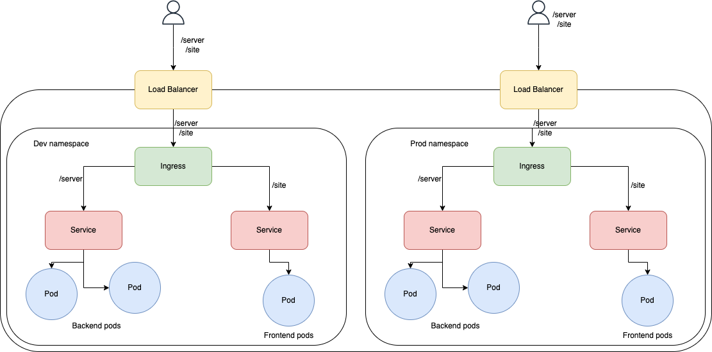

## Preparation & Requisites

Before you begin, ensure you have the following tools installed:

- **Git**
- **AWS CLI**
- **Terraform**
- **Kubectl**
- **eksctl**

Alternatively, you can use the provided `requirements.sh` script for MacOS.

## Folder Structure

```plaintext
gaf-tech
├── .github
  |    Documentation.md
├── code
  |    README.md
├── infrastructure
  |    Documentation.md
  |    README.md
├── k8s
  |   Documentation.md
  |   README.md
│   README.md
│   .gitignore
│   requirements.sh
```

Documentation is available in **each folder for the respective part of the exercise**. The directory structure is organized into **pipeline code**, **application code**, **infrastructure code**, and **Kubernetes manifest code**.

- Infrastructure [setup](infrastructure/eu-west-1/README.md) and [documentation](infrastructure/eu-west-1/Documentation.md)
- Kubernetes [setup](k8s/README.md) and [documentation](k8s/Documentation.md)
- Code [setup](code/README.md)
- Pipelines [setup and documentation](.github/workflows/Documentation.md)
## Infrastructure High-Level Design


**The Architecture Design is available in the source folder as `gaf.png`.**

The project consists of an EKS Cluster hosted on AWS, with the following networking architecture:

- 3 public subnets
- 3 private subnets
- 2 VPC endpoints in 3 subnets (required for ECR accessibility)
- 1 hosted zone with 1 record in Route53
- 1 Application Load Balancer (ALB)

Key infrastructure resources used include:

- EKS Cluster
- EC2 Managed Nodes
- VPC
- VPC Endpoints
- Route53
- ALB
- ECR

## Kubernetes Architecture



The Kubernetes architecture includes:

- 2 backend pods
- 1 frontend pod
- 2 NodePort services
- An Ingress controller directing traffic to `/server` and `/site`.

The frontend runs on port 3000, exposed at port 80, and the backend on port 8080, exposed at port 8080. The ALB listens at port 80 for lack of certificate.

## Design and Tool Choices

- **GitHub** is the primary version control tool for code and pipeline implementation.

- The deployment pipeline was developed to support multiple environemnts. currently there are two environments and there are `kustomization.yaml` files present. Both environments are in the same cluster but fully separated by namespaces.

- Terraform provides a comprehensive module for EKS, following AWS best practices for security group rules.

- For simplicity, `lock` and `terraform state` are kept local instead of using remote storage.

- A dedicated user with limited permissions was created for cluster connectivity and automation in GitHub Actions, enhancing cluster security.

- To simplify setup, the Kubernetes Control Plane allows public access. A more complex approach involving GitHub self-hosted runners or tools like Fluxcd or ArgoCD could have been used for automated deployments.

- Instructions for enabling DNS mapping of the Application Load Balancer are provided, although it requires a purchased domain or subdomain. The infrastructure provisions a hosted zone as an example.

- The ALB is configured as internet-facing due to the absence of a domain. Alternatively, it can be internalized and referenced in Route53 as a record.

- While an S3 VPC Endpoint could be used, it is unnecessary in this case as the NAT Gateway suffices. [References](https://docs.aws.amazon.com/AmazonECR/latest/userguide/vpc-endpoints.html)

This documentation provides an overview of the exercise, its prerequisites, folder structure, infrastructure design, and key design and tool choices.

**Please refer to the specific folders for detailed instructions on each part of the exercise.**
