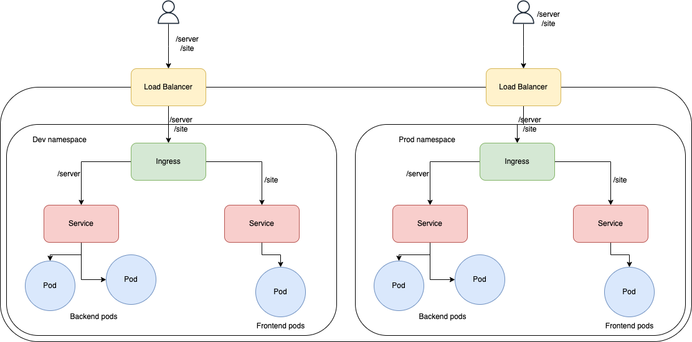

# Kubernetes Architecture

The Kubernetes architecture comprises the following components:

- 2 backend pods
- 1 frontend pod
- 2 services as NodePorts
- An Ingress controller that redirects traffic between two paths, `/server` and `/site`.

The frontend is a web application running on port 3000 and exposed at port 80, while the backend application is a server running on port 8080 and exposed at port 8080.

# Kubernetes Manifests Overview

In this documentation, we'll explore a set of Kubernetes manifests that are essential for deploying and managing your applications within a Kubernetes cluster. These manifests define various resources such as Deployments, Services, and Namespaces, each serving a specific purpose in your application architecture.

# Deployment Manifests

## Kubernetes Kustomization Manifest - `kustomization.yaml`

This Kubernetes Kustomization manifest file, named `kustomization.yaml`, is a configuration file used with `kubectl kustomize`. It defines how to customize and overlay resources for Kubernetes deployments. In this document, we'll explore its components and how it works.

## Overview

- **apiVersion:** The `apiVersion` field specifies the version of the Kustomize configuration API in use. In this case, it is set to `kustomize.config.k8s.io/v1beta1`, indicating the beta version of the Kustomize API.

- **kind:** The `kind` field specifies the type of Kubernetes resource this manifest represents. Here, it is `Kustomization`, indicating that this is a Kustomize configuration.

## Configuration Settings

- **bases:** The `bases` field defines the base directories or paths that contain the Kubernetes resource definitions that this Kustomization will build upon. In this case, there is one base path specified: `../../base`. This means that the `kustomization.yaml` file in the current directory will include and customize resources defined in the `../../base` directory.

- **namePrefix:** The `namePrefix` field allows you to add a prefix to the names of resources generated by this Kustomization. In this example, a prefix of `dev-` is added to the names of the resources.

- **namespace:** The `namespace` field specifies the namespace to which the customized resources should be deployed. In this case, all customized resources will be deployed to the `dev-gaf` namespace.

## How It Works

The primary purpose of this `kustomization.yaml` file is to define a customization process for Kubernetes resources. It specifies a base directory (`../../base`) where the base resource definitions are located. These base resources can be common configurations shared across different environments or applications.

The `namePrefix` field adds the prefix `dev-` to the names of resources. For example, if a resource in the base directory is named `my-service.yaml`, after applying this Kustomization, it will be renamed to `dev-my-service.yaml`.

Additionally, it sets the target namespace to `dev-gaf` or `prod-gaf` depending on the pipeline. This means that all resources generated or customized by this Kustomization will be deployed to the `dev-gaf` or `prod-gaf` namespace in your Kubernetes cluster.

To apply this Kustomization and generate the customized resource manifests, you can use the `kubectl kustomize` command with the path to the directory containing this `kustomization.yaml` file:

### `deployment.yaml` - Website Deployment

- **Namespace**: `$(namespace)`
- **Replicas**: 1
- **Selector**: `app: website`
- **Container Image**: `amazonaws.com/gaf-ecr-fe`
- **Port**: 3000

This Deployment manifest defines the deployment of a frontend website. It runs a single replica of a container named `website-container` using the specified image. The `app: website` label is used for selecting the pods associated with this deployment. The website is accessible on port 3000.

### `deployment.yaml` - Server Deployment

- **Namespace**: `$(namespace)`
- **Replicas**: 2
- **Selector**: `app: server`
- **Container Image**: `amazonaws.com/gaf-ecr-be`
- **Port**: 8080

This Deployment manifest defines the deployment of a backend server application. It runs two replicas of a container named `server-container` using the specified image. The `app: server` label is used for selecting the pods associated with this deployment. The server application is accessible on port 8080.

## Resource Configuration

### `kustomization.tmpl.yaml`

This manifest is a configuration file that lists the Kubernetes resources to be applied to the cluster. It references the following resources:
- `deployment.yaml` for website deployment.
- `namespace.yaml` to create the `$(namespace)` namespace.
- `service.yaml` for defining services.

Additionally, it provides image configurations for both frontend and backend containers, allowing customization of image names and tags.

## Namespace Manifest

### `namespace.yaml`

- **Name**: `$(namespace)`

This manifest defines a Kubernetes Namespace named `$(namespace)`. Namespaces are used to logically isolate and group resources within a Kubernetes cluster. All other resources specified in the manifests are created within this namespace.

## Service Manifests

### `service.yaml` - Website Service

- **Namespace**: `$(namespace)`
- **Name**: `website-service`
- **Type**: NodePort
- **Selector**: `app: website`
- **Port**: 80
- **Target Port**: 3000

This Service manifest defines a NodePort service named `website-service` within the `$(namespace)` namespace. It routes traffic to pods with the label `app: website`. It exposes port 80 externally, mapping it to target port 3000 on the pods. This allows external access to the website.

### `service.yaml` - Server Service

- **Namespace**: `$(namespace)`
- **Name**: `server-service`
- **Type**: NodePort
- **Selector**: `app: server`
- **Port**: 8080
- **Target Port**: 8080

This Service manifest defines a NodePort service named `server-service` within the `$(namespace)` namespace. It routes traffic to pods with the label `app: server`. It exposes port 8080 externally, mapping it to target port 8080 on the pods. This allows external access to the server application.

### `service.yaml` - Web Server Ingress

- **Purpose**: This Ingress manifest defines routing rules for external HTTP traffic.
- **Annotations**: It specifies that the associated Application Load Balancer (ALB) should be internet-facing.
- **Ingress Class**: It specifies the use of the ALB Ingress Controller.
- **Path Rules**:
  - `/server` Path: Routes traffic to the `server-service` on port 8080.
  - `/site` Path: Routes traffic to the `website-service` on port 80.

---

These Kubernetes manifests collectively define the architecture and components of your application within the Kubernetes cluster. The Deployments ensure that the desired number of replicas of your frontend and backend applications are running. Services provide external access to these applications, and the Namespace isolates them within the cluster.
